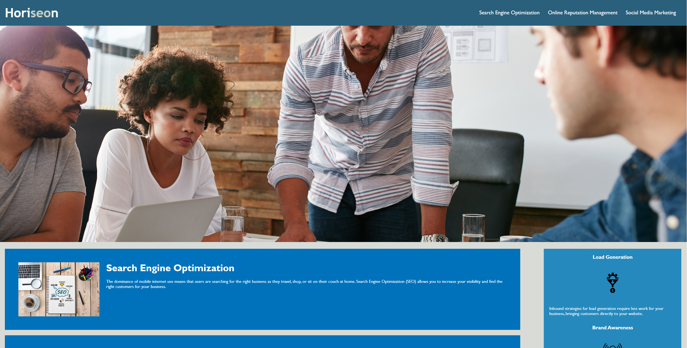

# Horiseon Social Solution Services
This is a mock-up company home webpage made for a class challenge, the site was altered to incorperate common accesibility standards such as alt text in image elements in order for screen readers to inform blind users of the image's content. The CSS sheet has also been altered to render the page in an accurate and sensible manner.

## Page Preview Screenshot:
*This is a screenshot of what the webpage should look like when viewed on a browser.*

## Webpage Link:
> **Use this link to view the webpage:** [link to the Horiseon webpage](antimatternova.github.io/Horiseon-Social-Services/)

## External Materials:
This site's main structer was provided by the education team at **Kansas University**.